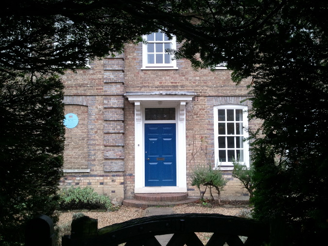
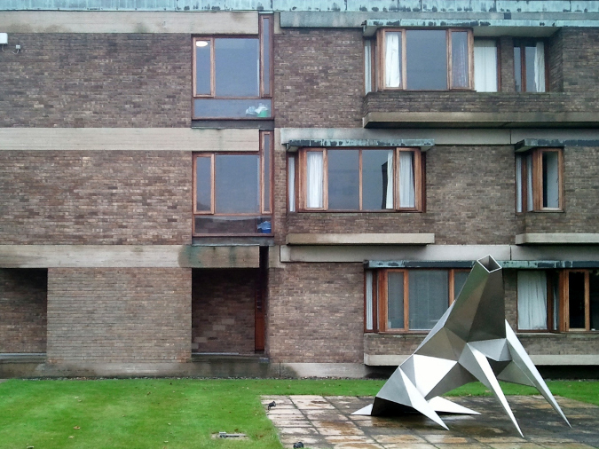

76 Storey's Way, now "Hostel V" in official college records, was once more
vividly known as Storey's End and home to Ludwig Wittgenstein's doctor.
Wittgenstein himself lived in the house during the final three months of his
life, and is buried in a small cemetary just around the corner.

So far I've been disappointed in my hopes of having a copy of the _Tractatus_
flung at me by an irritated poltergeist. The author probably couldn't find his
way through the house these days---the previous occupants' imposing stone facade
and dense shrubbery remain, but the interior walls have been shuffled: parlors
and servants' quarters made into bedrooms, kitchens re-floored in linoleum,
bathrooms subdivided into smaller bathrooms to house hastily-installed showers.
The garden, too, has been repurposed, now home to a teaching greenhouse, an art
studio, and a mysterious wooden shed whose sole purpose seems to be the storage
of cheap liquor.

For a fraction of what I once paid for a windowless partition in a decrepit
Bushwick loft, I have the largest bedroom I've ever occupied, with three
closets, a bricked-up fireplace, and a view onto our quiet, leafy street. Each
morning, a member of college staff arrives to clean the kitchen and bathrooms
and take out the trash. (This cheerful woman is known in Cambridge parlance as a
"bedder"; if I lived in proper college housing she would actually straighten the
inside of my room as well!) The housemates are mostly American, mostly
well-behaved and, like the rest of the Churchill student body, mostly
scientists.

Next door is the Fitzwilliam Master's Lodge, and then more Churchill housing.
The confusingly-named Hostels---stately Victorian homes wedged between the
Churchill and Trinity Hall playing fields---are the main graduate accommodation
provided by the college. Near the end of the campus are family flats and a
cluster of more modern single-occupancy apartments which are known as the
"Pepperpots" but resemble no receptacle I have ever seen used for storing
spices. The street terminates with a bright red mailbox bearing the royal cypher
of George VI.

Churchill College itself is a great deal less picturesque---the archetype of
certain regrettable architectural fashions of the 1960s. Unfinished brick and
concrete planes project awkwardly from the corners of every building; wooden
window casings stubbornly refuse to line up with each other or lie flush in the
faces of the walls that contain them; vaguely menacing cubist beast-sculptures
rise up from obsessively-tended lawns. The only feature I really enjoy is the
airy, wood-paneled dining hall, where I (surprisingly often) find myself
lingering in conversation over a plate of rudely boiled root vegetables or a
candlelit glass of wine.

Things are quieter here than in the center of town. Churchill attracts few
tourists, and neighboring Fitz and Murray Edwards even fewer, so the only
traffic comes from scientists and students _en route_ to the math department or
laboratories at the West Cambridge Site. These two locations also conveniently
house all of my lectures and research meetings, and without occasional
obligations at Queens' and Sunday trips to the farmers' market it would be very
easy to forget about the existence of the medieval City altogether.
