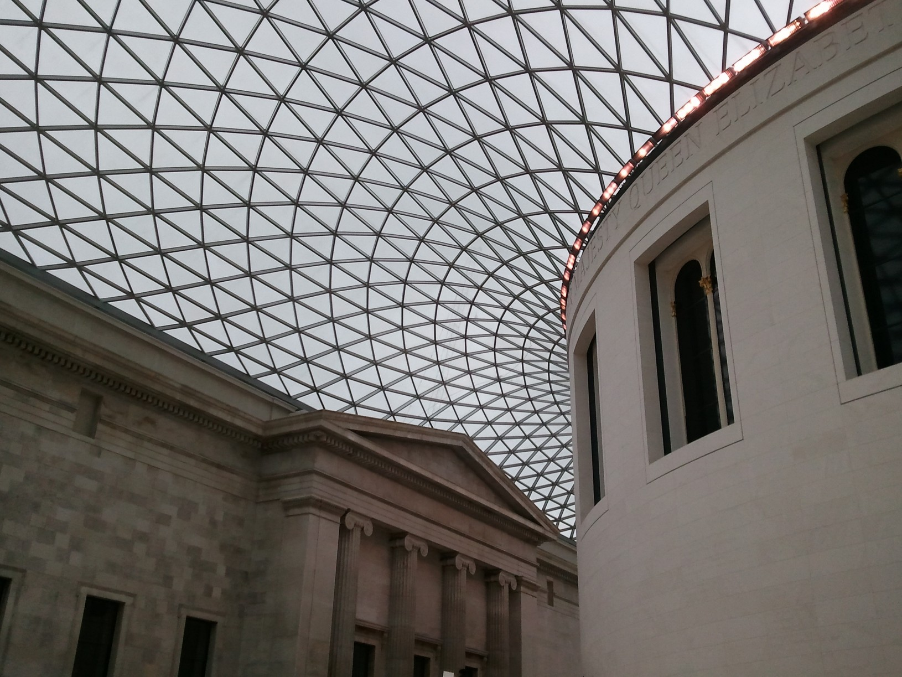

The train from Cambridge to London takes less than an hour and costs twenty
pounds for a round trip with the purchase of a national rail card. Sixty minutes
is insufficient time to prepare for the transition from our sleepy academic town
to the auditory and olfactory violence of Liverpool Street---shrieking infants,
Japanese carry-out, cigarettes, clattering train cars materialize suddenly;
escalators taller than most university buildings disgorge rush-hour crowds onto
crowded streets.

It's not hard to believe that this was once the administrative center for a
quarter of the world's territory; the endless pediments and colonnades of
Whitehall and Westminster are far more than this rainy little island demands for
itself. We wander: through a pub, past cathedrals and ferris wheels, over
bridges. A half-hour ride on clean a tube train so packed with impossibly polite
commuters as to restrict breathing deposits me at my godmother's North London
home.

We rise early the next morning for a backstage tour of the Cabinet War Rooms.
The museum is precisely what the name suggests---an underground collection of
glassed-off enclosures from which the defense of England was orchestrated. We
are invited behind the glass, and the museum trip consists mostly of fondling
maps and telephones from the Second World War while obstructing the view of
puzzled tourists. (Somewhere there is a photograph of me sitting in Churchill's
own chair. The arm still bears the indentation of his fingernails.)

Next we are trotted out before the trustees of the Foundation in a lunch at the
British museum.  Two shocks: the first when one of our hosts sticks his hand out
and introduces himself with my benefactor's surname, the second when I suddenly
recognize the former prime minister's eyes in his daughter's and granddaughter's
faces.

The granddaughter, in discussing her father's appointment as ambassador to
France, mentions in passing that hers "is a conservative family". Another
curiosity: I have no doubt that American political orientations hew just as
closely to family lines, but no American would admit to voting Democratic simply
because her father did---party affiliations in the States are always matters of
absolute moral rectitude.

Evening is a hipster bar with overpriced and undercarbonated beer, then an
obligatory Brick Lane curry marred only by an unhealthy-looking blue lamp which
the restaurant's proprietors refuse to let us turn off, then a (considerably
more comfortable) tube ride back north.

There is something luxurious about electing to take a "slow train", as I do the
next morning on the way back to Cambridge. The train is slower than
anticipated---track work means I am forced to take one line from Finsbury Park
to Welwyn Garden City, another from Welwyn Garden City to Hitchin, a bus from
Hitchin to Letchworth Garden City and a third train thence to Cambridge. It is
Rememberance Sunday, and a voice over the loudspeaker at my first stop requests
two minutes of silence in honor of the war dead, a task made easier by the fact
that I am alone in the station.  The very slow trip is nonetheless well worth
it. The autumn countryside is a glorious blaze of gold and waxy green, and the
countryside stations where I find myself trapped warm and quiet.
