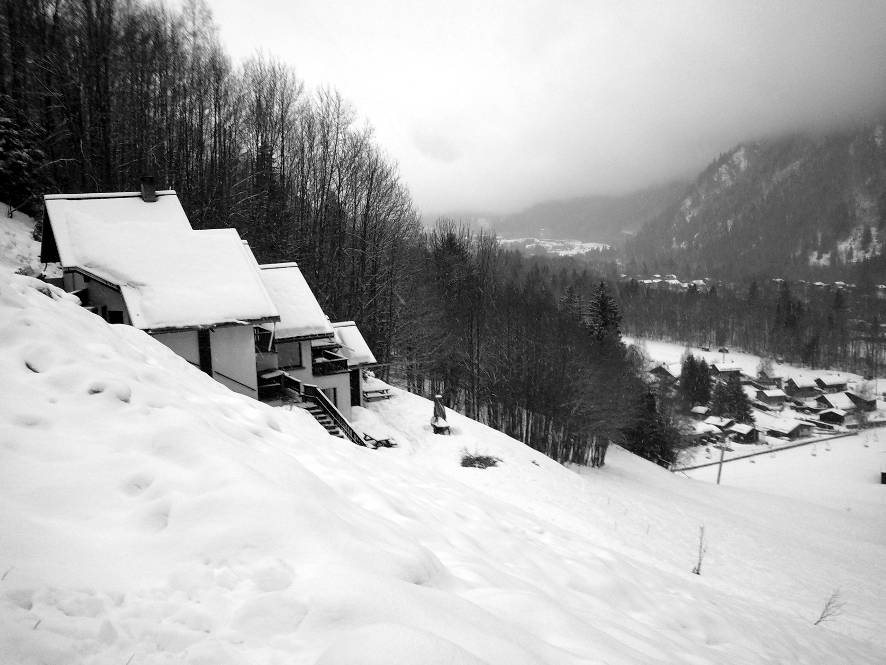
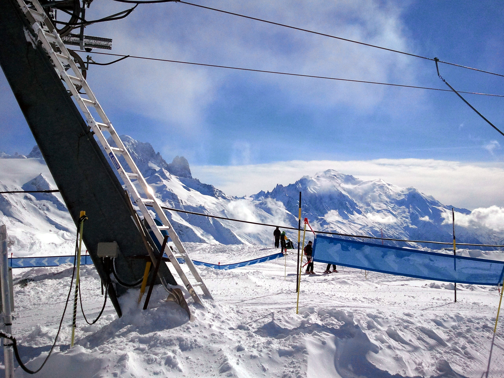

It's raining in Geneva when we land. 
Higher up in the Alps it becomes sleet, then snow, 
driving sideways against the car 
as we make our way up winding highways 
supported on narrow concrete columns 
so tall we cannot see the valley
floor below us. 
Mahler is blasting on the radio.

Just out of Chamonix 
we climb up a steep road at the base of Mont Blanc
(stopping midway to attach chains clumsily, with frozen fingers), 
and unload our bags at the Chalet Beaumont. 
We return to town (chains off), 
buy cartloads of spaghetti fixings, wine, and cheese, 
then return to the chalet (chains on) 
for a late dinner and early bed.

Morning is clear and cold. 
The other side of the valley, 
hidden by clouds the previous day, 
opens up wide and white just outside the kitchen window. 
We head (chains off) toward the Domaine de Balme.
In a rental shop at the base of the mountain,
a six-foot-tall Frenchwoman in overalls
cackles at her own jokes,
related in an incomprehensible bilingual patois,
as she fits our boots.

Last night's snow is deep on the ground, 
titanium-white and near-insubstantial---a 
mountain of feathers, 
a dream of confectioner's sugar, 
an ocean of cocaine. 
Every corner reveals a new picture-book landscape 
of impossibly pointy mountaintops
or conifer-edged alpine rivers.
We return to the chalet
with gloves stiffened by frozen sweat
as the temperature drops with the sun.

The next day dawns clear, 
but by midmorning clouds have swallowed up the mountains again
and snow is falling thickly.
Below the peak of La Flegere fog and flat light erase the mountainside:
one discovers that one has missed the edge of the trail
somewhere between slipping into freefall
and landing on the powdery slope below.
We stay mostly off-piste, 
retracing endless variations 
on a path down a precipitous, tree-studded shoulder
which terminates at the base of the bunny hill.
Later in the afternoon we climb 
to the lip of an untouched bowl---a
promise of clean powder
and the threat of an avalanche.
But I make it back unharmed,
cutting broad tracks through thick powder
all the way down the mountain.

The next day we return to Geneva.
We start with a tour of CERN,
where we interrogate our tour guide
(a serious Polish materials engineer)
about the details of the cooling system
and fend off questions from a purported Welsh journalist
who seems curiously uninformed
about the basic workings of the LHC.
We descend deep belowground to the CMS,
literal tons of precision wiring, cathedral-tall,
wrapped around a beam line the width of a drainpipe.

Geneva is cobbled and gray.
We pass by Borges' final apartment
and through a narrow store full of ancient books,
then catch a bus back toward the airport.
