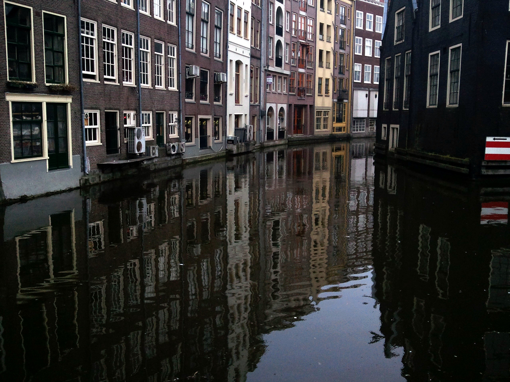
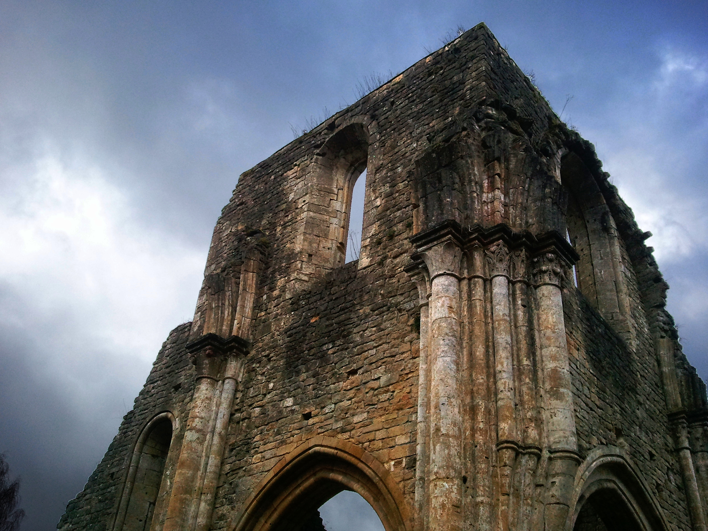
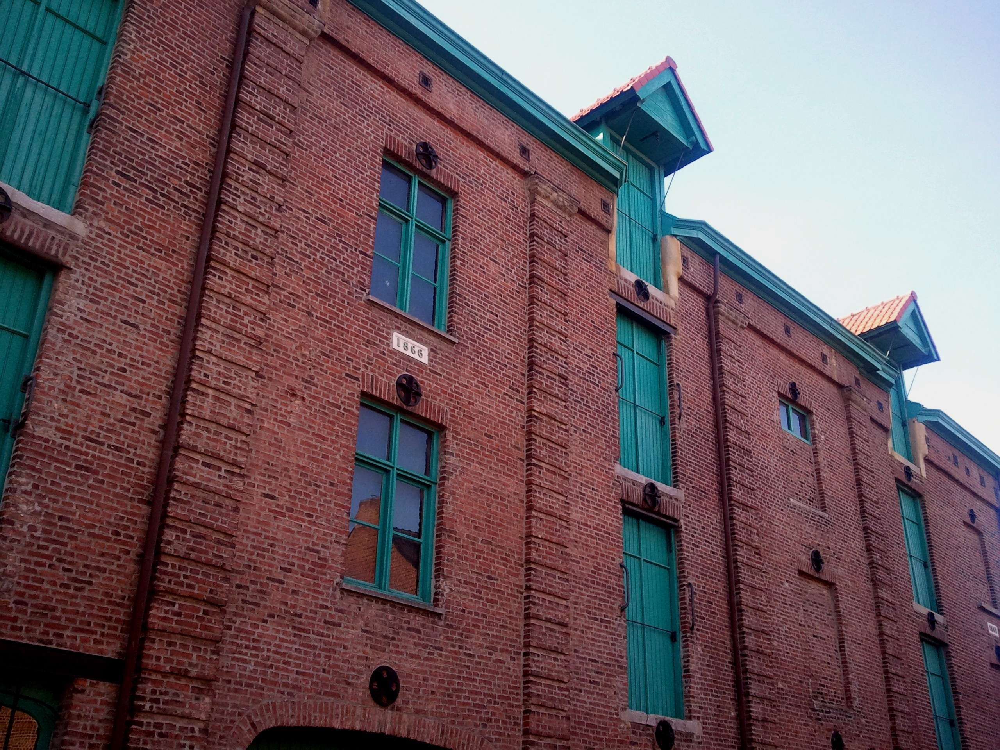
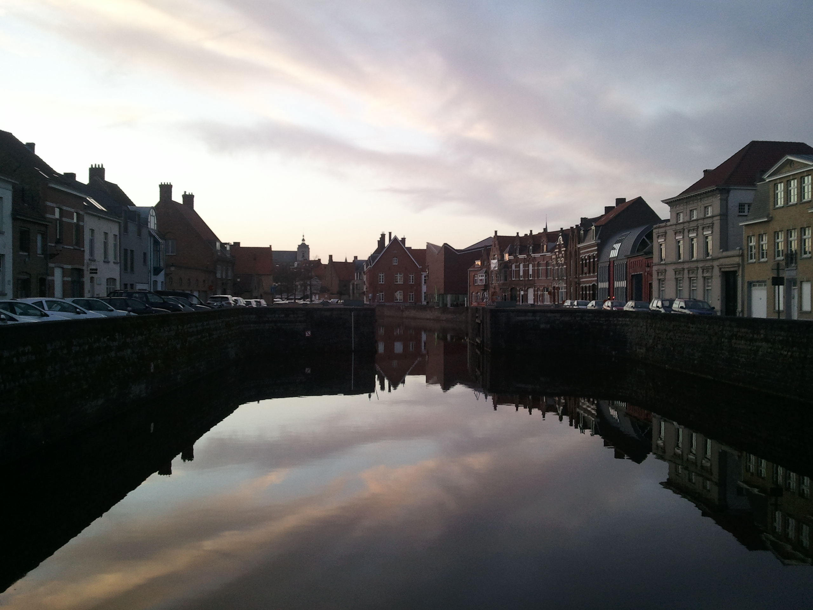

The streets of Mechelin ring hourly with the chimes of bells in tall towers, but
the city is crumbling: the cobbled streets are buckled and full of holes, and
eroded brick drips from tilting Gothic facades. We have beer (the first five of
the fifty-one recipes we will eventually try) at Het Anker, then drive through a
series of small Belgian towns on the way to Westmalle Abbey. The abbey is closed
to visitors, but after croques-monsieur and more
beer at the attached restaurant we stroll through the nearby fields as the sun
goes down.

We tour Amsterdam the next morning in a haze (atmospheric, not pharmacological).
Crooked canalside buildings loom in the fog and trams ring distantly at water
crossings. In the afternoon, after a quick meal in an Indonesian luncheonette,
we enter an unassuming brick church with an astonishing green interior, painted
minutely on every surface and terminating in an outrageous Baroque altar that,
for once, doesn't look too extravagant for the structure that contains it.

Our remaining day in Amsterdam: the Stedelijk museum, a brief and frigid meal in
the open air, a long walk to the transplanted van Gogh museum, The Potato
Eaters, The Yellow House, Sunflowers, Cypresses and Two Women, coffee,
rijsttafel, more beer.

Next we drive to Utrecht and walk along new canals. Lunch is sandwiches which,
in an alarming echo of our Moroccan sandwich-ordering crisis, take nearly 45
minutes to prepare and nearly make us late for an afternoon beer tour. We throw
change on the table and break the speed limit on the way to the abbey, arriving
just in time. After the tour ends we stay for vespers inside: monks in
cream-colored habits gather, chant simply but mostly meditate in silence.  We
arrive in Liege around nightfall.

We begin the next day wandering through the ruins of the old abbey at Orval.
After another slow lunch of sandwiches (at this point in the trip we swear off
ordering them ever again), we sprint to La Chouffe just in time for yet another
tour. Afterwards we wander through the adjacent woods, which are rich with the
smell of manure from nearby fields and the acidity of pine. Our hostel turns out
to be a gathering-place for Flemish expatriates in the heart of Wallonia, and at
night locals crowd the bar and jabber animatedly in Dutch at the proprietor.

Little figures of the crucifiction or the Piet&agrave; are scattered throughout
the countryside.  We arrive early in Rochefort, where a monk inside the
gatehouse waves at us, then returns to his reading without responding to our
gestures in the direction of the door, then head to Chimay, whose fat
Benedictine porter is more than happy to open up. We wander through a abbey
graveyard, a neat grid of identical crosses.

Next is a brief detour through France, where another beermaker has agreed to
open up his brewery (in fact a large wooden shed in his backyard) for us even
though it's the weekend. The shed is jammed with brewing tuns, crates of beer,
bottling and labeling machines. We talk hop and malt choices, lament Europeans'
limited tolerance for bitterness, poke at his computer, then drink.

Next we drive to Watou, where we settle in to a palatial (and empty!) country
house meant to hold a busload of beer tourists visiting St. Bernardus. We cycle
to nearby town on unreliable bikes provided by the guesthouse operators (mine
has a flat tire) and nearly initiate a diplomatic incident when we fail to order
drinks with our dinner. The guesthouse provides beer---unlimited, free and
alcoholic---and we spend the rest of the evening haphazardly attempting to catch
up on work while we sample everything that St. Bernardus has ever brewed.

We arrive at Westvleteren precisely on time for our 10 o'clock appointment, but
a monk shoos us away from the entrance of the abbey: they have no beer today.
There's a little to drink in the shop, so we order and savor slowly (it is,
after all, before noon).

Bruges is warm, with red window casings, red brick and orange streets at sunset.
We are given a tour of the Halve Maan brewery by a miserable tour guide (the
facilities are fascinating), and spend the evening in the hostel trying to fend
off attempts at conversation by a drunk Vancouverite who doesn't understand why
people here aren't treating him with more respect ("after all, the Canadians
liberated this place!").

Brussels, the day following, is a real city, dirty and urban, with anarchist
slogans spraypainted in three languages on soot-covered neo-classical monuments.
We order a heaping plate of grilled fish for a few Euros a person in an Arab
neighborhood, and manage to visit two more beer bars. Finally, full and drunk
with a week's worth of Belgian beer, we prepare to head home.
